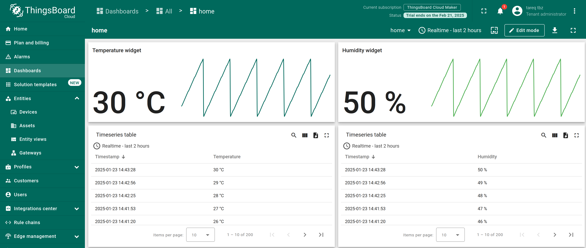
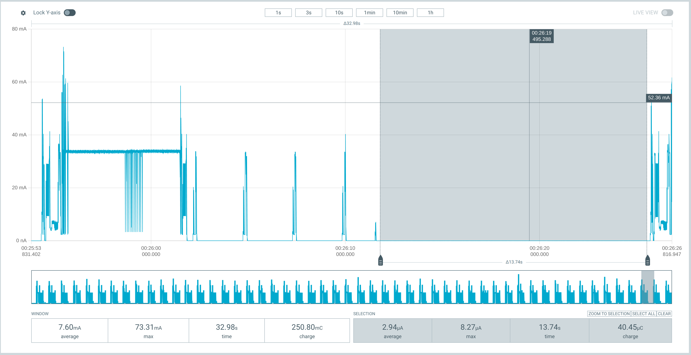

# 🌡️ LTE Environmental Sensor

## 📌 Overview

A minimal application aimed to test sending data from a CoAP client to a CoAP server (Thingsboard) over LTE-M/NB-IoT with PSM mode enabled to save energy.

The used board is the nRF9160 discovery board from Nordic.

- Received data in thingsboard



- Current consumption of the board



## Getting started

Before getting started, make sure you have a proper nRF Connect SDK development environment.
Follow the official
[Getting started guide](https://developer.nordicsemi.com/nRF_Connect_SDK/doc/latest/nrf/getting_started.html).

### Initialization

```shell
# Prepare workspace and virtual env
mkdir ws
python -m venv --copies ws/.venv
. ws/.venv/bin/activate
pip install west

# Initialize workspace
west init -m git@github.com:TAREQ-TBZ/lte_environmental_sensor.git --mr main ws
cd ws
west update

# Install additional requirements
pip install -r zephyr/scripts/requirements.txt
pip install -r nrf/scripts/requirements.txt
pip install -r bootloader/mcuboot/scripts/requirements.txt
```

### Building and running

To build the main application, run the following command:

```shell
west build --sysbuild -b <YOURBOARD> application/app
```

To flash the firmware:

```shell
west flash
```

## Building with vscode

Add the board folder and application to NRF Connect in your .vscode/settings.json

```json
{
    "nrf-connect.applications": [
        "${workspaceFolder}/application/app"
    ],
    "nrf-connect.boardRoots": [
        "${workspaceFolder}/application/"
    ]
}
```
